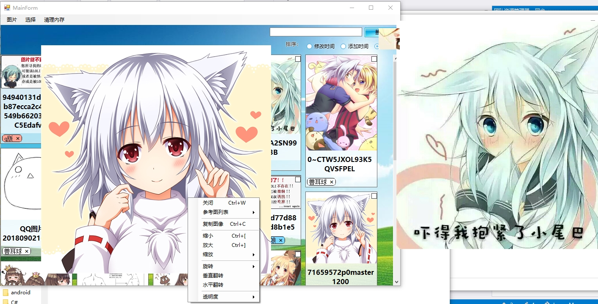

#  图片标签管理器

###  功能

- 支持常见的主流图片、PSD和webp格式预览。
- 支持图片贴标签分类。
- 支持图片屏幕贴图。贴图可以缩放、旋转、透明化或者折叠。
- 支持截屏功能，截取下来的图将会成为新的屏幕贴图。
- 支持内存清理。

<a href="说明文档.docx">说明文档</a>

##  更新

### 2019年6月16日更新

- 折叠贴图可以缩放图片的BUG。
- 删除标签出现的空指针异常。
- 查询限定标签问题。
- 优化查询添加标签限定的体验。
- 添加升序降序排序。
- 解决了排序的BUG。

### 2019-4-27更新 
+ 折叠贴图的时候，会以鼠标为中心折叠。
+ 展开贴图的时候，会还原到原先的位置。
+ 解决了截图窗口不能顶置的问题。
+ 没有修复其他的任何BUG。

