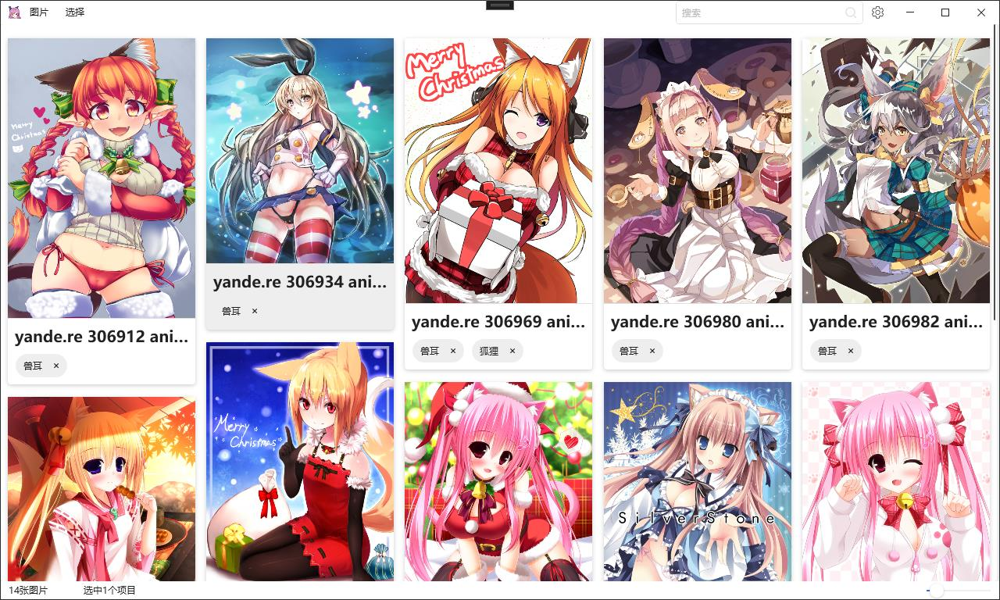
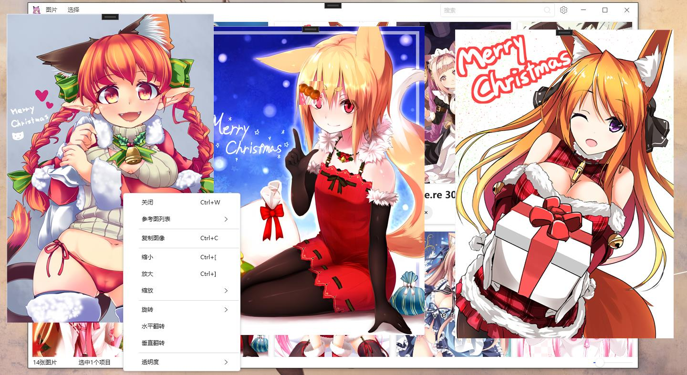
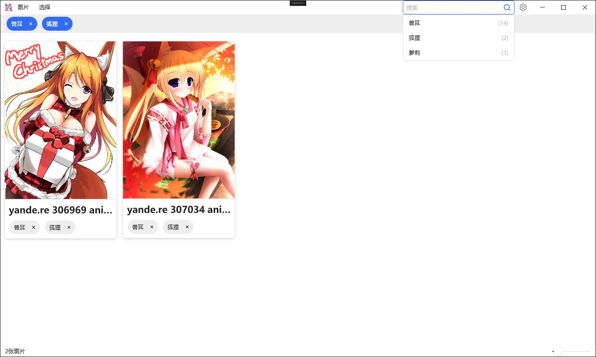
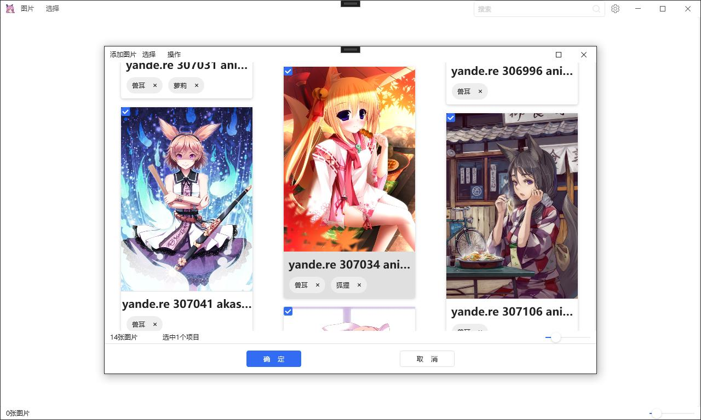

#  素材管理姬

### 简介

素材管理姬是一款好用的画师素材管理辅助助手，支持使用标签分类高效管理图片素材。支持广泛的图片格式，支持截屏，以及参考图贴屏显示。

###  功能

- 支持常见的主流图片，包括PSD和webp格式。
- 支持图片的标签分类与检索。
- 支持图片屏幕贴图。贴图可以缩放、旋转、透明化或者折叠。
- 支持截屏功能，截取下来的图将会成为新的屏幕贴图。

**贴屏显示：**

**标签检索**

**添加图片：**

##  更新日志

### 3.1.5 

**开发中……From 2023年7月19日**

- [ ] 优化性能和减少内存占用（完成50%）
- [x] 修正添加图片取消后出现崩溃的错误。
- [ ] 图片数据库导出和导入（完成50%）[#1](/../../issues/1)
- [ ] 文件夹导入
- [ ] 支持拖拽导入
- [ ] 快速输入多个标签 [#1](/../../issues/1)
- [ ] 标签折叠 [#1](/../../issues/1)
- [ ] 支持更多的排序方式 [#1](/../../issues/1)
- [ ] 支持换肤

### 3.1.4 2023年5月13日

- 调整截图逻辑。

- 调整图片缩放滑动条的体验。

  

### 3.1.3 2023年4月13日

- 修正多开逻辑错误。
- 错误弹窗更加友好。
- 修正不能添加标签的错误。

### 3.1.2 2023年4月5日

- 修改截图的逻辑。
- 添加错误收集处理机制。
- 支持自动更新。
- 在开始菜单栏添加删除软件的功能。
- 修正添加文件后更新主界面提示弹窗的两个按钮均为更新主界面操作的BUG。
- 删除弹窗中点击鼠标弹出的错误。
- 解决启动时候的一些错误。

### 3.1.1 2023年2月2日

- 解决安装后因缺乏权限而无法运行的错误。

### 3.1.0 2023年2月2日

- 初版发布

